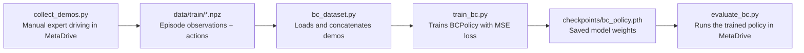

# MetaDrive Behavioral Cloning

This repository collects expert driving demonstrations in MetaDrive, trains a small behavioral cloning policy on the saved data, and evaluates the policy back in the simulator.

## Overview

The project is organized as a simple pipeline:



## Architecture

### Data collection

`collect_demos.py` starts a `MetaDriveEnv` with manual control enabled. While you drive, it records pairs of:

- the current observation before each environment step
- the action taken by the human/expert driver

Each finished episode is saved as a compressed NumPy archive in `data/train/episode_###.npz`.

### Dataset layer

`bc_dataset.py` defines `BehavioralCloningDataset`, which:

- finds all `.npz` files under `data/train/`
- loads and concatenates all observations and actions
- returns PyTorch tensors from `__getitem__`

The current dataset format is:

- observation: shape `(259,)`
- action: shape `(2,)`

### Policy network

`model.py` defines `BCPolicy`, a small feed-forward network:

- input: 259-dimensional observation vector
- hidden layers: 256 -> 256 -> 128
- output: 2 continuous action values

The output corresponds to:

- steering
- throttle/brake

### Training

`train_bc.py`:

- loads the dataset with `DataLoader`
- trains the policy with mean squared error loss
- uses Adam optimization
- saves weights to `checkpoints/bc_policy.pth`

### Evaluation

`evaluate_bc.py`:

- loads the saved checkpoint
- resets MetaDrive with the same environment settings used during collection
- feeds each observation through the policy
- clips actions to MetaDrive's `[-1, 1]` range before stepping the environment

## How to Run

All commands below assume you are in the repository root.

### 1. Set up dependencies

Install the Python packages needed by the scripts if they are not already available in your environment:

```powershell
pip install torch numpy opencv-python metadrive
```

If you already have the provided `venv`, activate it first and then run the scripts from that environment.

### 2. Collect demonstrations

Drive the car manually and save episodes into `data/train/`:

```powershell
python collect_demos.py
```

Optional camera-based observation mode:

```powershell
python collect_demos.py --observation rgb_camera
```

Controls during collection:

- `W`, `A`, `S`, `D` to drive
- `T` to toggle takeover
- `Esc` to quit

### 3. Train the policy

```powershell
python train_bc.py
```

This script reads all demonstrations under `data/train/` and writes the trained checkpoint to `checkpoints/bc_policy.pth`.

### 4. Evaluate the trained policy

```powershell
python evaluate_bc.py
```

This loads `checkpoints/bc_policy.pth` and runs the policy in MetaDrive.

### 5. Run the sanity tests

These scripts are useful for checking shapes, data loading, and model behavior:

```powershell
python test_dataset.py
python test_model.py
python test_training_sample.py
python test_action_timing.py
```

## Project Structure

- `collect_demos.py` - records expert demonstrations from MetaDrive
- `bc_dataset.py` - dataset wrapper for demonstration files
- `model.py` - behavioral cloning policy network
- `train_bc.py` - trains and saves the policy
- `evaluate_bc.py` - loads the trained policy and evaluates it in the simulator
- `inspect_dataset.py` - helper script for inspecting the dataset
- `inspect_actions.py` - helper script for inspecting action timing / values
- `test_*.py` - lightweight validation scripts for shapes and behavior
- `data/train/` - collected training demonstrations
- `checkpoints/` - saved model weights

## Notes

- The training and evaluation scripts expect the checkpoint at `checkpoints/bc_policy.pth`.
- The repository currently includes `checkpoints/bc_policy_50eps.pth`; if you want to use it directly, either copy or rename it to `bc_policy.pth`, or update the checkpoint path in the scripts.
- `collect_demos.py` and `evaluate_bc.py` use the same MetaDrive environment settings so the policy is trained and tested on matching observations.